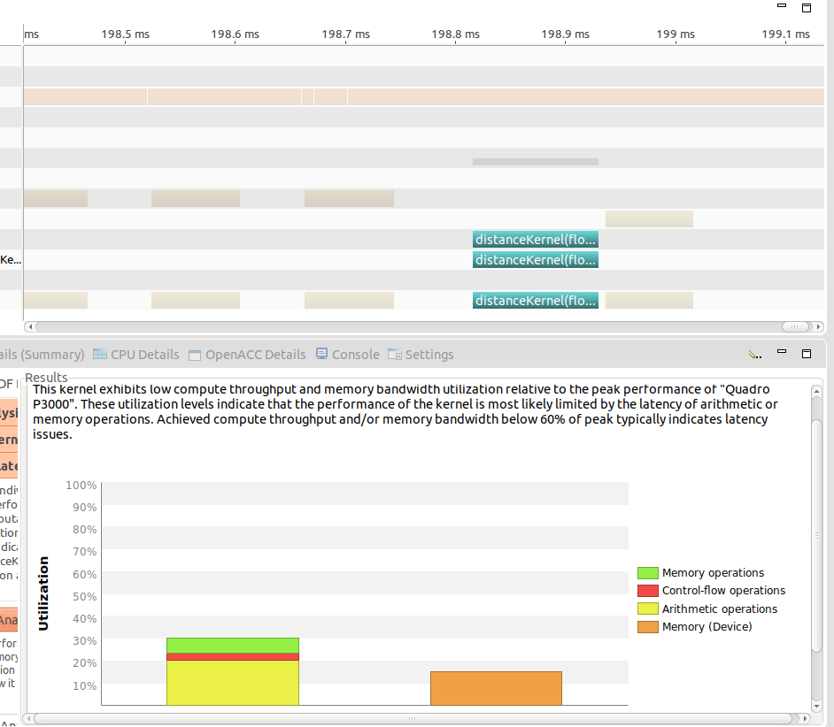

# Appendix D: CUDA Practicalities: Timing, Profiling, Error Handling, and Debugging

This appendix deals with some of the key things one needs to know when developing applications using CUDA. Most of these are very tactical or pragmatic... how do you show how much faster your CUDA code is? How to you know where it is bogging down?, how do you debug it?

## Standard C Timing Methods
This example modifies a code block from Chapter 3 and instruments it with timing information.

```bash
$ make
/usr/local/cuda-9.0/bin/nvcc -g -G -Xcompiler -Wall -c main.cpp -o main.o
/usr/local/cuda-9.0/bin/nvcc main.o kernel.o -o main

$ ./main
Kernel time (ms): 0.014000
Data transfer time (ms): 13.612000
```

According to the text, the CPU time is correct, but the kernel time is not. Authors use this as an opportunity to explain the difference between Synchronous and Asynchronous operations on the device. As you might expect, a call to `cudaMemcpy()` is synchronous whereas the kernel call is not. This can be addressed using CUDA-specific timing methods based on CUDA events

```bash
$ cd dist_v2_cuda_events/
$ make
/usr/local/cuda-9.0/bin/nvcc -g -G -Xcompiler -Wall -c kernel.cu -o kernel.o
/usr/local/cuda-9.0/bin/nvcc main.o kernel.o -o main

$ ./main
Kernel time (ms): 0.115520
Data transfer time (ms): 13.590464

```

## Profiling with the NVIDIA Visual Profiler
This section simply gives a tour of the profiler. The [full user guide is available online](https://docs.nvidia.com/cuda/profiler-users-guide/index.html). I found this to be quite helpful and have included a screen shot of a profiling session below:



This application is run on Linux by simply issuing the following command:

```bash
$ nvvp
```

## Error Handling
This section describes the error handling abilities built in to the CUDA runtime. In a similar fashion to the timing example things are a little different when considering synchronous and asynchronous methods.

### Synchronous Calls
One way of handling errors is to check the `cudaError_t` return variable as in the following example:

```c
cudaError_t err = cudaMalloc(&d_in, len*sizeof(float));
if (err != cudaSuccess) printf("%s\n", cudaGetErrorString(err));
```

While this works, you could also include `helper_cuda.h` from the CUDA Samples (`common/inc` directory). This is essentially a wrapper and can be used as follows:

```c
checkCudaErrors(cudaMalloc(&d_in, len*sizeof(float)));
```

### Asynchronous Calls (Kernel methods)
You can check for errors that occurred when launching a kernel by calling the built-in `cudaGetLastError()` or `cudaPeekAtLastError()`.

To handle errors with asynchronous calls, however, we need to ensure that the kernels have completed. This can be done via `cudaDeviceSynchronize()`. The following example shows a full version with both methods applied:

```c
distanceKernel<<<len/TPB, TPB>>>(d_out, d_in, ref);
cudaError_t errSync = cudaGetLastError();
cudaError_t errAsync = cudaDeviceSynchronize();
if (errSync != cudaSuccess)
    printf("Sync kernel error: %sn", cudaGetErrorString(errSync));
if (errAsync != cudaSuccess)
    printf("Async kernel error: %sn", cudaGetErrorString(errAsync));
```

A working example of this is provided in the `dist_v2_cuda_errors` directory.

The authors also demonstrate a guard against over-loading the device by checking for device properties. They further demonstrate how to get/check the currently-available device properties and demonstrate it. 

```c
__global__
void distanceKernel(float *d_out, float *d_in, float ref, int len) {
    const int i = blockIdx.x*blockDim.x + threadIdx.x;
    if (i >= len) return;
    d_out[i] = distance(d_in[i], ref);
}
```

They also provide a little snippet that shows how to query the device properties. This wasn't fully accurate in the text, so a working/tested version is included in the `device_properties` directory.


```bash
$ cd device_properties
$ make
/usr/local/cuda-9.0/bin/nvcc -g -G -Xcompiler -Wall -I /usr/local/cuda-9.0/include -c main.cpp -o main
$ ./main
Number of devices: 1
-------------------------
Device Number: 0
Device Name: Quadro P3000
Compute Capability: 6.1
Maximum threads/block: 1024
Shared memory/block: 49152 bytes
Total global memory: 6350045184 bytes

```


## Cuda Debugging
We have seen a bit of cuda-gdb already in the Appendix C and D examples. This section simply walked through the debugger in more detail. The following shows some key commands we ran during this section:

```bash
$ cuda-gdb main
(cuda-gdb) set cuda software_preemption on
(cuda-gdb) show cuda software_preemption
(cuda-gdb) break kernel.cu:14
(cuda-gdb) break main.cpp:23
(cuda-gdb) run  
(cuda-gdb) next
(cuda-gdb) print i
(cuda-gdb) cuda kernel block thread
(cuda-gdb) cuda block 1,0,0 thread 5,0,0
(cuda-gdb) print i
(cuda-gdb) clear kernel.cu:14
(cuda-gdb) continue
(cuda-gdb) info locals
(cuda-gdb) print out[0]@64
(cuda-gdb) continue
(cuda-gdb) quit
```


## Cuda Memory Management
The authors didn't say much about this, other than describing what it is and suggesting you learn more about it. It is designed to check for memory allocation/deallocation errors, leaks, etc. Running it on one of the previously-built utilties can be seen in the following:

```bash
$ cuda-memcheck main
========= CUDA-MEMCHECK
Kernel time (ms): 1.384000
Data transfer time (ms): 13.638000
========= ERROR SUMMARY: 0 errors

```
