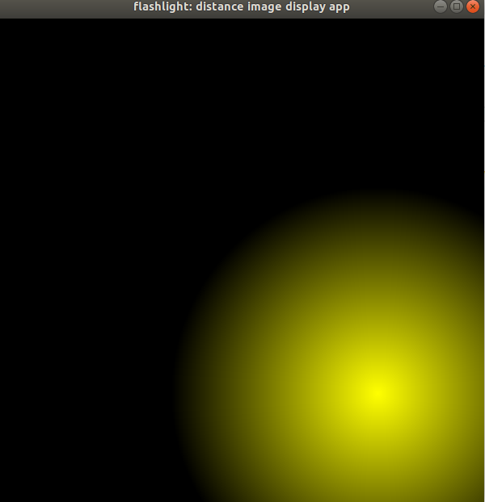
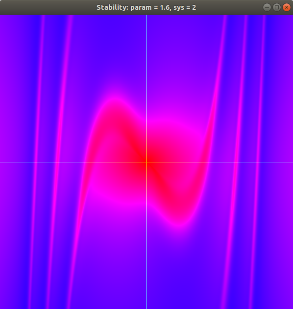

# Chapter 4: 2D Grids and Interactive Graphics

This chapter finally begins to move us from the very basics into a few problems that are closer to the real-world use-cases of CUDA. Up to this point, we have been working in 1D land (vectors and arrays). Now we move to two dimensions. Much remains the same, but we need to consider how we keep track of where each thread is supposed to be working and we do this by tracking the current/assigned row and column. Whereas previously we used a calcuation such as this:

```c++
const int i = blockIdx.x * blockDim.x + threadIdx.x;
```

We will now use something more along the lines of:

```c++
int col = blockIdx.x * blockDim.x + threadIdx.x;
int row = blockIdx.y * blockDim.y + threadIdx.y;
```

Like most any two-dimensional work in C/C++, we will still be storing our data in 1D space, so we calculate our index as follows:

```c++
int i = row * w + col;
// where w is the size of the width of the 2D structure
```

## dist_2d

While it doesn't provide any output, the code listing for `dist_2d` does provide a workable sample of some of the concepts presented so far in this chapter (working in two dimensional space).

This example is extended a bit in `dist_rgba`. This example is designed to be more realistic in that rather than single floats for each position, it uses a `uchar4` struct that allows for the red, green, blue and alpha channels to all be stored together.

## Flashlight App

This is where we start to put things together... and in doing so, start to see any issues in our setup. While my CUDA platform was working properly (due to the checkpoints in the Appendices), I ran into some issues with building this example.

The first was easy enough to fix... my system was missing the development libraries for `libglew`. This was fixed by simply installing them:

```bash
$ sudo apt-get install libglew-dev
```

The next issue was slighthly more thorny... I kept getting the following error when attempting to build:

```bash
/usr/bin/ld: /usr/local/cuda-9.0/samples/common/lib/linux/x86_64/libGLEW.a(glew.o): relocation R_X86_64_32S against `.rodata' can not be used when making a shared object; recompile with -fPIC
```

After thinking about it a bit (and getting nowhere with my google-foo), I tried a number of things and ended up simply removing the explicit link/pointer to the version of `libGLEW.a` in the NVIDIA SDK and allowed the compiler to find it using its normal paths. As soon as I did this, the build errors went away and I was able to run it successfully. As such, you will find the first `LDFLAGS` line in my `Makefile` commented out.

Once I got past the build/compilation issues, running the application worked exactly as it should and was quite interesting to think through everything that was happening, and how little code it took to get it so.



The stated intent of this sample is to provide the reader with a working example application that can be modified for their own use/application... a stub, or framework of sorts. I found the authors' code walkthrough helpful but, for the first time in the book, found myself missing a level of detail regarding some of the code blocks. This is consistent with the intent of the book, however. The goal is to focus on what you need to know to accomplish something and, while part of me would like to understand the nuances of some of the OpenGL code in this example, that detail is irrelevant for the primary use case (surfacing CUDA calcuations in realtime).

I will say, I am impressed by how smoothly the application redraws and responds to mouse movements.


## Application: Stability

The test of any "framework" or "scaffolding" is a working sample, and this next section of the book aims to do just that. They start by describing the problem they want to visualize: stability of a linear oscillator. While not entirely necessary, they then explain how they take a single second-order ordinary differential equation (ODE) and re-work it into a system of two first-order ODEs for the purpose of the application. They proceed to explain that the reasoning behind this is to _"compute a solution that is a sequence of states, arising from a single initial state, in a method that is completely serial"_. This approach lends itself very well to a massively-parallel platform such as the GPU.

The core premise of this example (to show how easily the flashlight app could be modified to do something real) is borne out. There are significant changes to `kernel.cu` as this is where the actual calculations occur. A minor change (function declaration) was made to `kernel.h`. A few changes were made to `interactions.h` only to adjust the way the keyboard controlled the application. Finally, the `render()` method in `main.cpp` was adjusted slightly for the change in the kernel launcher and for some cosmetic changes to the displayed window's title bar.




[<< Previous ](../Chapter_03/readme.md)
|
[ Next >>](../Chapter_05/readme.md)
