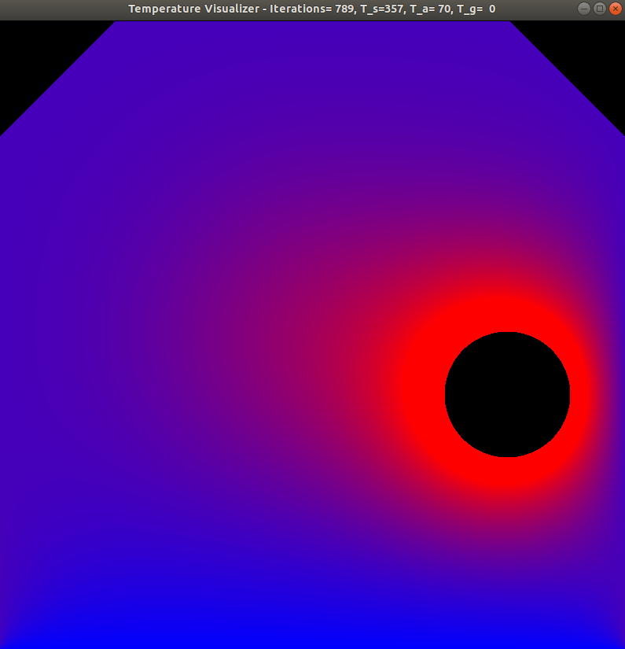

# Chapter 5: Stencils and Shared Memory

This chapter digs further into some of the complexities of highly-multithreaded computing. Specifically, we have been looking at data-parallel problems and here the focus shifts to thread inter-dependence.

The chapter starts with a discussion of the different types of memory available:

- Host Memory: RAM on the host/computer
- Global Memory: Primary memory on the GPU - available to all but slower/further away
- Shared Memory: Positioned next to each Streaming Multiprocessor and avaialble to all threads in that block
- Register Memory: This is where the variables for each thread live

The authors walk the reader through an example of computing a derivative using global memory. While this functions as it should, they use it as a means of highlighting the negative use scenarios of global memory. In this case, every element in the input data gets read 3x, resulting in latency due to memory transfer costs.

The authors use the term _halo cells_ to refer to the cells/data added to the beginning/end of any array to ensure that the calcuations performed on the points of interest are calculated properly. This might involve copying a few cells from the beginning of the array to the end to ensure the calculations performed on the actual tail of the data have the input values needed.

> A comment on nomenclature: From my reading of the text, "stencils" is the same as "filters" is the same as "convolutions". Depending on your background (image processing, signal processing, etc.) various of these words may resonate more with you. I called it out as "filters" and "convolutions" are familar to me whereas "stencils" are not.

The last half of the chapter or so uses an image processing/sharpening example to highlight the impact of choices made in memory use.

The first uses global memory, the second uses shared memory for the input array, and the third uses shared memory for both the input and output arrays. Simply looking at the line counts shows that the latter two take much more coding effort to get working properly. That said, the shared memory approaches are far more efficient.

The chapter concludes with a handful of exercises that utilize the profiler to inspect various aspects of the running application.

[<< Previous](../Chapter_04/readme.md)
|
[Next >>](../Chapter_06/readme.md)
