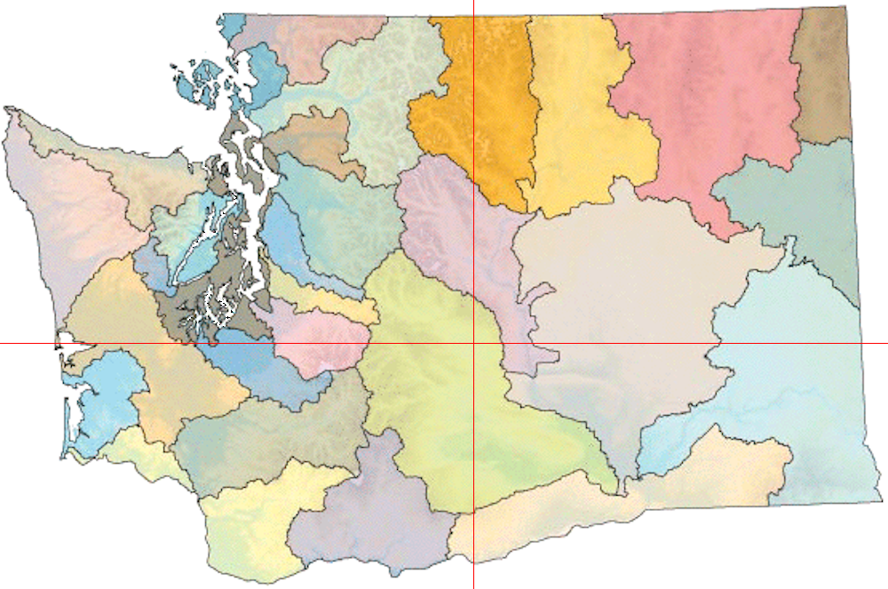

# Chapter 6: Reduction and Atomic Functions

This is a relatively short chapter that is focused on the operations at the end of a parallel computation job: reduction and atomic functions.

## Atomic Functions

Any student of multi-threaded computing will be familiar the sort of reduction needs that occur at the end of a job... the individual components have done their work and now the results need to be combined into that single answer at the end. CUDA provides a series of functions that are avaialble for use and provide safe implementations of these operations. The example in the book highlights `atomicAdd()` but there are also `adomicSub()`, `atomicExch()`, `atomicMin()`, `atomicMax()`, `atomicInc()`, `atomicDec()`, `atomicCAS()` (compare and swap), `atomicAnd()`, `atomicOr()` and `atomicXor()`. In each case, the functions ensure that they are performed in a manner optimized for the GPU (efficient) and thread-safe.

## Practical Example
The second portion of the chapter is an example of using these atomic functions to find the center point of an image and to modify the image to highlight that point. This feels like a bit of a contrived example but it does give a tangible use case (and re-uses some of the image manipulation code seen in chapter 5.)

[<< Previous](../Chapter_05/readme.md)
|
[Next >>](../Chapter_07/readme.md)
