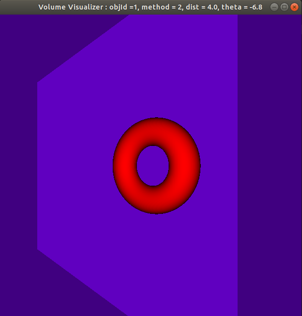

# Chapter 7: Interacting with 3D Data

Having worked with 1d data for most of the book and addressing 2d data for a few chapters, this chapter focuses entirely on 3d data and specifically how you can launch a 3-dimensional grid using the input parameters to your kernels.

## 3D Distance
After giving the reader an idea of where we are going, the text jumps into an example of launching 3D grids by porting our (now familiar) `dist` application to 3D. Specifically, both the `blockSize` and `gridSize` parameters use the full properties of the `dim3` structure used to initialize them. This allows for the X, Y, and Z values to be set.

## Volumetric Rendering
The text quickly moves on to the meat of the chapter which focuses on building a volumetric rendering of a torus in 3D and allowing the user to interact with it. As you might imagine, this is built on top of the UI/GPU framework established earlier (`flashlight` app). Again we see the value of a simple but useable framework/platform.

Much of the subsequent text is specific to the problem being solved, but it is worth studying as they illustrate how the 3D grid enables logical interactions with the data (as it is, itself, 3D) rather than having to mentally bend back to a 1D or 2D data/compute model.

The image below is a capture of the running application:

[<< Previous](../Chapter_06/readme.md)
|
[Next >>](../Chapter_08/readme.md)
