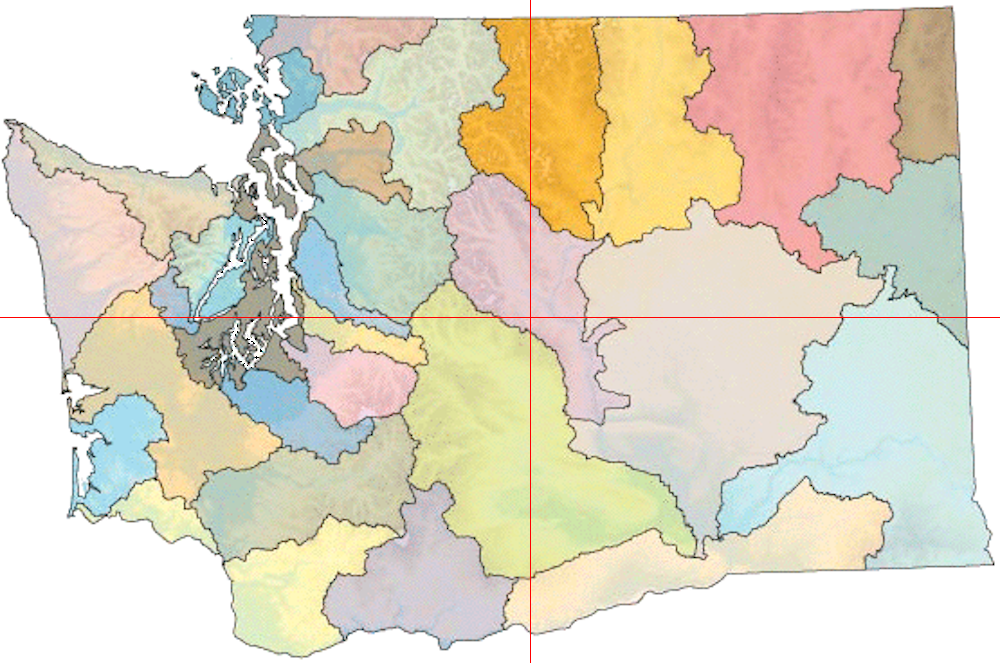

# Chapter 8: Using CUDA Libraries

## Thrust

- inner product

- distance via transform()
-- functors
-- lambda functions
same as the functor, but this time with lambda functions
-- using fusion

## cuRAND

## NPP (NVIDIA Performance Primitives)

## cuSOLVER

## cuBLAS

## cuDNN

## ArrayFire

[<< Previous](../Chapter_07/readme.md)
|
[Next >>](../Chapter_09/readme.md)
