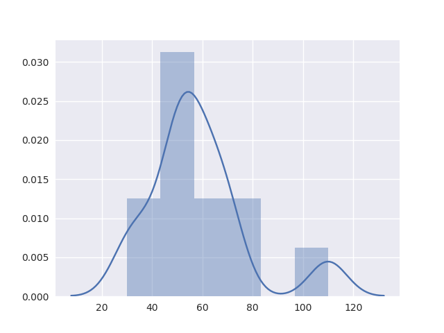
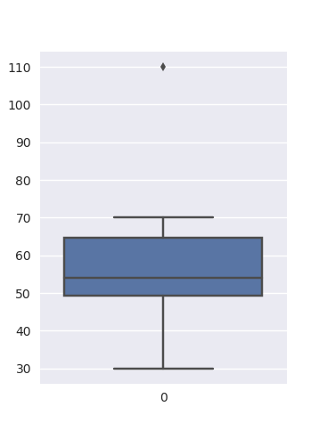

# Chapter 2: Getting to Know Your Data

## General Types of Data Sets
- Records: traditional database table/excel sheet mental model, term frequency vector, etc.
- Graphs: network or social information structures
- Ordered: Sort of like a record, but the field may contain multiple items

## Characteristics to consider
- Dimensionality
- Sparsity
- Resolution
- Similarity

### Attribute Value Types
- Nominal: profession, id numbers, eye color, zip codes
- Ordinal: rankings (relative to each other), military, grades, etc.
- Binary: positive/negative (has cancer/not)
- Interval: calendar dates
- Ratio: length, time, counts
- Discrete: finite (or countably infinite) set of values
- Continuous: real numbers, infinite precision is possible

## Ways to Understand your Data

Sample Values for following items:
```python
data = [30, 36, 47, 50, 52, 52, 56, 60, 63, 70, 70, 110]
```

### Measuring Central Tendency
This means to do exactly what it sounds like... calculate the middle point, or tendency of the data... where do most of the values sort of go?

__Mean__: Average

Sample:  or Full Population: 

Using our data from above, the mean is `58`.

Alternatively, you can use the Trimmed mean (chops extreme values). This requires the provision of a weight assigned to each value (_where does this come from?_)


__Median__: middle value of set.


Using our data from above, the median is `54`.

__Mode__: Value (or values) that occurs most frequently in the data. Can end up with bimodal or trimodal data


Using our data above, the mode is `52` and `70`. The data is `bimodal`.

__MidRange__: Average of the largest and smallest values in the set


The midrange of our data sample is `70`.

### Symmetric vs. Skewed Data
If plotted, where is the "hump"?
- Symmetric: hump is in the center. Often called "normal" distribution
- Negatively skewed: hump is on the left side. Mode is less than both median and mean
- Postively skewed: hump is on the right. Mode is greater than both median and mean

```python
import matplotlib.pyplot as plt
import seaborn as sns

data = [30, 36, 47, 50, 52, 52, 56, 60, 63, 70, 70, 110]
sns.set(color_codes=True)
sns.distplot(data)
plt.show()
```


### Measuring the Dispersion of Data
- Quartiles: Q1 (25th percentile - `47`), Q3 (75th percentile - `63`)
- Interquartile range: IQR = Q3-Q1 or `16`
- Five number summary: min, Q1, Median, Q3, max (note that this is *not* the mean). Our values are `30, 47, 54, 63, 110`
- Boxplot: visible version of the five-number summary. Median is marked, box start at Q1 and ends at Q3. Whiskers are at min/max unless there are outliers (> 1.5xIQR). If there exists outliers, the Whiskers mark the min/max values that are *not* outliers and then the outliers are marked individually.

> Note: For this data set, the IQR is `16`. Therefore any value more than 24 away from the median is considered an outlier (range is `30 - 78`).

```python
import matplotlib.pyplot as plt
import seaborn as sns

data = [30, 36, 47, 50, 52, 52, 56, 60, 63, 70, 70, 110]
sns.set(color_codes=True)
sns.boxplot(data=data)
plt.show()
```



Variance (where sample: s, popuation: theta)


For the above data, the squared variance is `379.17`.

Standard Deviation is the square root of the variance squared

For our example, the standard deviation is approximately `19.47`

## Normal Distribution Curves:
- the range from mu-theta to mu+theata contains approximately 68% of the measurements
- from mu-2theta to mu+2theata contains 95% of it
- from mu-3theta to mu+3theata we see 99.7%

## Visualizing data sets
- Five-Number summary is described above
- Boxplot is described above (really just a visual version of the 5-number summary)
- Histograms can often communicate more than a boxplot... shows how the values are distributed over space (see distribution plot above)
- Quantile Plot: Displays all the data, plots quantile information. For each f value on the x axis, indicates that % of values are below (to the left) of that spot)
- Quantile-Quantile (Q-Q) plot: Graphs the quantiles of one univarite distributeion against the quantiles of another. Shows if there is a shift occuring between two distributions
- Scatter Plot: Quick look at bivariate data.
  - May help you see trends/clusters at quick glance
  - Can see uncorrelated data
  - can see negatively correlated/positively correlated data

### Why Visualize?
- Gain Insight
- Qualitative overview of large data sets
- visual proof

## Various Approaches
- Pixel-Oriented
- Geometric projection
- Icon-based
- Hierarchical
- Complex relations

__Similarity__: Numerical measure of how alike two objects are. As the number increases, so does similarity. Often 0.0:1.0

__Dissimilarity__: Inverse of the above. Lower numbers are more alike minimum is 0, upper number varies

__Proximity__: measurement of similarity or dissimilarity.

Can use Data matricies and a dissimilarity matrix to show the distance between points.

### For _nominal values

dissimimilarity is a simple binary check (0=same, 1=different)


where `m` is the number of matched attributes and `p` is the total number of attributes


### For _binary_ values,

Consider symmetric binary dissimilarity


And asymmetric binary dissimilarity


Where:
- `q` is the number of attributes that `== 1` given i or j
- `r` is the number of attributes that `== 1` given i and `== 0` given j
- `s` is the number of attributes that `== 0` given i and `== 1` given j
- `t` is the number of attributes that `== 0` given i or j
- `p` is the total number of attributes

### For _numeric_ values,

__Minkowski Distance__ is the generic form, where h = the order on the Lh norm


__Manhattan Distance__ is the L1 norm. Same as Minkowski but h=1


__Euclidean Distance__ is the L2 norm. Same as Minkowski but h=2


### For _ordinal_ values,

Easiest thing is to map the ordinal values to numeric values (ranged 0.0 - 1.0 or similar). This works particularly well if they are equal-weighted and can, if needed, be skewed (inter-value distances) if additional weight needs to be conveyed.

### For _document_ types,
For documents, cosine similarity between two term-frequency vectors is often used. The general equation is as follows:


A more clearly-worked out example:


