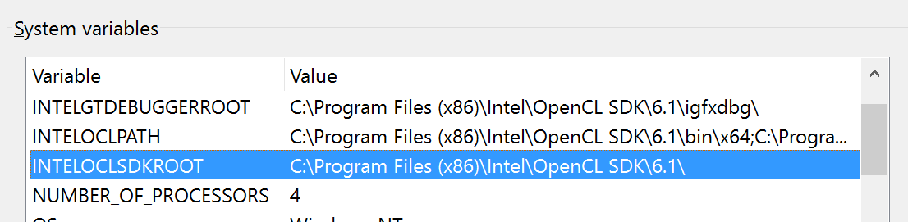
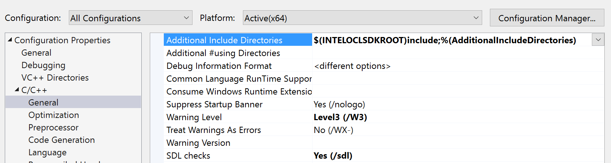
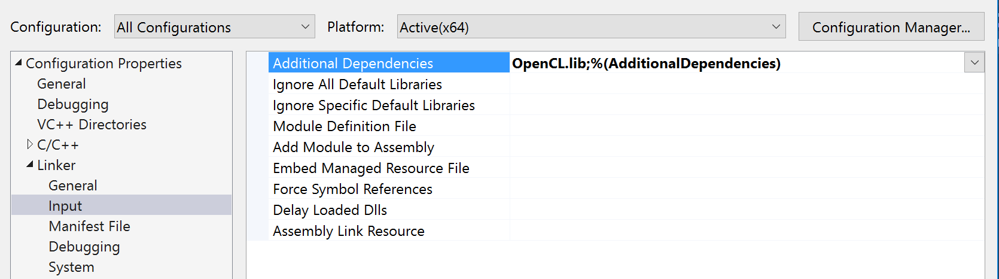

# Setup

This book didn't really include a section on setting up your environment for testing or building the code examples in the book or even where to get Open CL 2.0. This page details the steps I went through attempting to get things working properly on my machine.

## Environment

- Windows 10 (MS Surface Pro 4)
- Visual Studio 2015 Community Edition with C++ support

For the purposes of this walk-through I am attempting to utilize entirely free software and tools. This is not due to any particular dislike of commercial tools, but rather to ensure that anyone interested could follow along and have the same experience.

## Installation

There are a number of SDKs you can install to get OpenCL - NVidia, AMD, Intel to name a few. It is important to note, that you really don't need any of them. This situation is best explained via the following quote:

> At the lowest level, the various OpenCL SDKs are the same; they all include `cl.h` from the [Khronos](http://www.khronos.org/registry/cl/) website. Once you've included that header you can write to the OpenCL API, and then you need to link to `OpenCL.lib`, which is also supplied in the SDK. At runtime, your application will load the `OpenCL.dll` that your GPU vendor has installed in `/Windows/System32`

_Credit to [dithermaster](http://stackoverflow.com/users/1745695/dithermaster) on [StackOverflow](http://stackoverflow.com/questions/22364133/opencl-which-sdk-is-best)._

For my purposes, I elected to install the [Intel OpenCL SDK](https://software.intel.com/en-us/intel-opencl). I cannot give a particlarly strong reason for this choice, other than that the graphics card in my current machine is provided by Intel. Further, it seemed that they might have a slightly less "their view of the world" instantiation of the docs and related samples. I was concerned that NVidia would be too CUDA focused and that AMD would be too "not-NVidia" focused - both likely unfounded concerns.

## Configuration

Next, I set out to ensure my development enviornment was aware of the SDK and had the goal of building one of the sample applications to confirm that everything was working as it should. For this step, I followed some of the instructions on [this blog post from Stream Computing](https://streamcomputing.eu/blog/2015-03-16/how-to-install-opencl-on-windows/).

Because the post above referenced the NVidia SDK in the images, I'm providing the images below only to show the differences when using the Intel SDK.

After installing the Intel SDK, I had a few new environment variables: 

We will utilize these to help configure Visual Studio to support OpenCL.

First, we need to tell VS about the OpenCL Headers: 

Next, we need to configure the linker to use the `OpenCL.lib` as a dependency: 

and also link to any additional libraries: 

I then built the simple test app provided in blog above (code is available in the `validation01` directory). Running the program (`validation01.exe`) results in the following:

```text
Detected OpenCL platforms: 2
Press any key to continue . . .
```

This confirms my setup, and shows that OpenCL can see both my OpenCL-enabled CPU and GPU.

I again want to give credit to [Anca Hamuraru](https://streamcomputing.eu/blog/author/anca/) for his [(indirect) assistance](https://streamcomputing.eu/blog/2015-03-16/how-to-install-opencl-on-windows/) with this post.

[<< Previous](../README.md)
|
[Next >>](../Chapter_01/README.md)