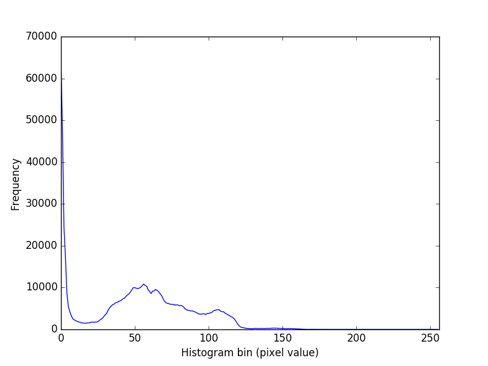
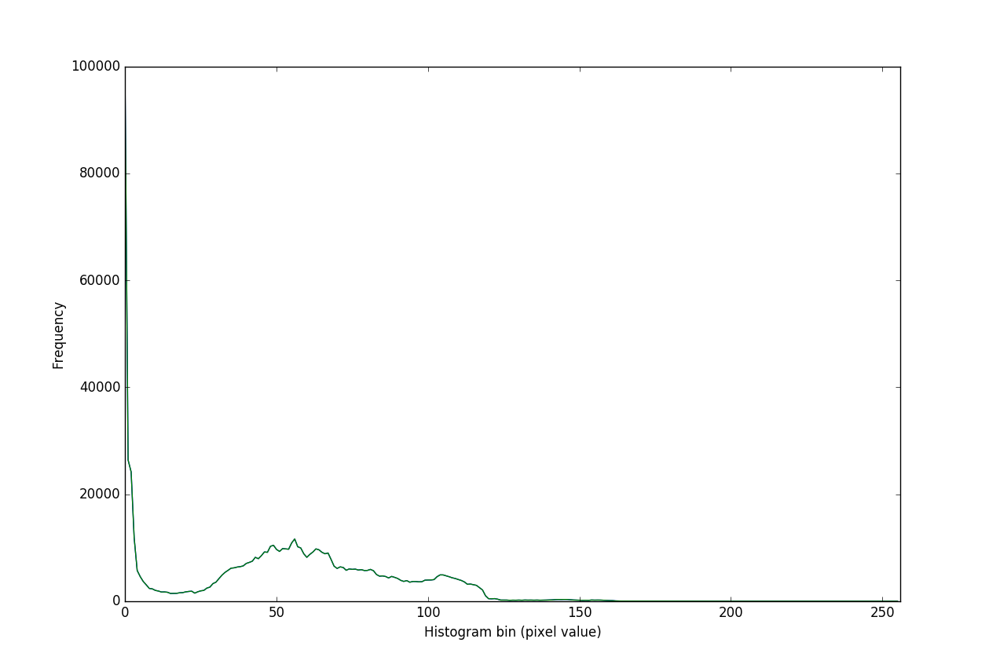

# Chapter 4 - Examples

This chapter provides some OpenCL examples centered around image manipulation. The examples are slightly contrived with the purpose of demonstrating various features of OpenCL.

## Histogram

The first example creates a histogram of an image. This program is fairly straight forward, however, like many of the examples in the book, I found it lacking in that it didn't actually output anything (at least not in the sample code). It ran the calculations, and then you were expected to assume it actually did what it said it would. Not finding this satisfactory, I set out to have it dump the data out so that it could be visualized in some fashion. To this end, I tweaked the sample code to do a crude dump of the calculated values to a csv-like string and stored them in `test.csv`. I then used a simple python script (`hist.py`) to generate a histogram as shown below:

It was quite a good idea that I did this (output and validation stage) as I had a small yet significant error in my code (`+` rather than a `*`) and my initial output data was completely incorrect.

## Image Rotation

This example worked farily well, although I had some issues with typos (mine) and it took a bit to get that sorted. Of note, the code listing in the book attempts to rotate cat.bmp and this works properly. The listing in the solution/source download provided by the vendor's site rotates cat-face.bmp and I was unable to get this working. With the only difference being the image name, I would repeated get a `OpenCL err (-54)` error when running the application. According to the [Stream Computing website](https://streamcomputing.eu/blog/2013-04-28/opencl-error-codes/) the error is of type `CL_INVALID_WORK_GROUP_SIZE` and is described as:

> if local_work_size is specified and number of work-items specified by global_work_size is not evenly divisable by size of work-group given by local_work_size or does not match the work-group size specified for kernel

In this case, the image that works (`cat.bmp`) is 760 KB and its dimensions are 1080x720 with a bit-depth of 8. The image that doesn't work (`cat-face.bmp`) is 2.99 MB and is 1772x1772 pixels, again with a bit-depth of 8.

As you can see, in the case of the image that works, both dimensions are evenly divisible by 8 (size of the defined `localWorkSize`) whereas the larger image (`cat-face.bmp`) is not. I changed the dimensions of the `localWorkSize` to 4 (evenly divides into 1772) and the code ran successfully. Looks like one would need to tune this setting by the image dimensions at runtime rather than hard-coding them into the app for actual utility.

## Image Convolution

This program used the C++ interface rather than the C version. Additionally, there was a significant difference in the version of the code provided in the book and the one available in the book downloads - specifically, the book downloads included many more filters: rather than just a `gaussianBlurFilter` it also included:

- sharpenFilter
- edgeSharpenFilter
- vertEdgeDetectFilter
- embossFilter

As such, I used the expanded code listing for my tests. Additionally, I ran the program with each filter and stored the resulting output.

This example demonstrates some key features such as `CLK_FILTER_NEAREST` and `CL_ADDRESS_CLAMP_TO_EDGE` which returns the nearest pixel without interpolation and determines how to handle out-of-bounds accesses respectively.

## Producer-Consumer

This example is designed to demonstrate a number of different features including the notion of taking data from one kernel and passing it along to the next stage of the process. It additionally shows running the various kernels on different processors. The program logic loads an image, passes it to a convolution kernel running on the gpu and then, for demonstration purposes, passes it to the histogram kernel running on the cpu.

In a similar vein as the histogram example, the output of this test program was quite unsatisfying in that it simply says "passed" or "failed". In my case, it always says "failed". I did some digging in the code and this failure exists in the downloadable sample code but not the in-book sample. The download sample compares the generated histogram against a "gold" histogram but doesn't provide any context for this. I modified the program to both perform a comparison as well as dump the data to the screen for further analysis. Running a plot of the two data sets shows some minor variances but nothing of significance. The plot below shows two lines (yes, it only looks like one). There is a slight fuzziness to the line due to the double-plot.

[<< Previous](../Chapter_03/README.md)
|
[Next >>](../Chapter_05/README.md)