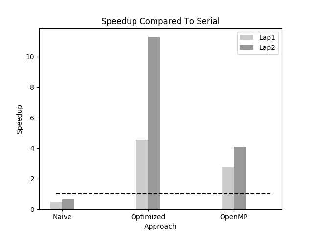
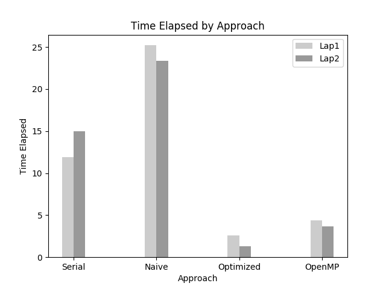

# Chapter 4: Using OpenACC for Your First Program

The aim of this chapter is to walk the user through creating their first OpenACC program. I must say, however, that I appreciate the approach taken by the author. Rather than simply giving you a bit of code to compile/run, there is a clear intentionality to teach the reader. The author begins by explaining the problem and having the user implement the application  in a serial fashion (much the way they recommend throughout the book) and then proceed from there. My notes on this section follow my walk-through of the exercises.

## Setup

I am utilizing two different machines for this lab. The first (Lap01) is my main laptop that I carry each day and has the following specifications:

- Ubuntu 18.04 LTS
- 32 GB RAM
- Intel Core i7-7820HQ CPU @ 2.90 GHz x 8
- Quadro M1200/PCIe/SSE2

The second machine is a bigger laptop (Lap02) and is provided for comparison purposes as it has a better GPU. Its specifications are as follows:

- Ubuntu 18.04 LTS
- 32 GB RAM
- Intel Core i7-820HQ CPU @ 2.90 GHz x 8
- Quadro P3000/PCIe/SSE2

Each time that results are presented below they are (unless otherwise noted) the average of five (5) identical runs. In each case, the numbers are observed to ensure that there exists no outliers.

## Serial Code

This step was rather straight-forward. I simply implemented the code as described and compiled it on both machines using the command below:

```bash
pgcc laplace.c -o serial
```

The results were mildly surprising as I expected my otherwise "beefier" laptop (LAP2) to perform better, however that was not the case.

| LAP1 | LAP2 |
|-----:|-----:|
| 11.9111286 | 14.9974238 |

## Naive Parallel

In this step, we simply added a couple of `#pragma acc kernels` calls and recompiled. This seems like an amazingly trivial step, but it had a non-trival impact.

```bash
pgcc -acc -Minfo=acc laplace.c -o naive
```

You may notice the `-Minfo=acc` argument above - this was recommended by the author as it instructs the compliler to tell you what it is doing... I found this quite interesting and the following is a "dump" from Lap1:

```bash
$ pgcc -acc -Minfo=acc laplace.c -o naive
main:
     26, Generating implicit copyin(Temperature_previous[:][:])
         Generating implicit copyout(Temperature[1:1000][1:1000])
     27, Loop is parallelizable
     28, Loop is parallelizable
         Accelerator kernel generated
         Generating Tesla code
         27, #pragma acc loop gang, vector(4) /* blockIdx.y threadIdx.y */
         28, #pragma acc loop gang, vector(32) /* blockIdx.x threadIdx.x */
     38, Generating implicit copyin(Temperature[1:1000][1:1000])
         Generating implicit copy(Temperature_previous[1:1000][1:1000])
     39, Loop is parallelizable
     40, Loop is parallelizable
         Accelerator kernel generated
         Generating Tesla code
         39, #pragma acc loop gang, vector(4) /* blockIdx.y threadIdx.y */
         40, #pragma acc loop gang, vector(32) /* blockIdx.x threadIdx.x */
         41, Generating implicit reduction(max:worst_dt)
```

Similar to the author, I clearly utilized the GPU, however I had a negative speedup (not good) due to data transfer issues. Intersetingly, the performance of the two machines swapped, likely due to the better GPU on LAP2.

| LAP1 | LAP2 |
|-----:|-----:|
| 25.2094258 | 23.356386 |

## Optimized Parallel

Consistent with the advice given throughout the book, the next step is to profile our executable and try to understand why things didn't go as we expected them to. While there are many ways to accomplish this (see Chapter 3), a simple starting point is `export PGI_ACC_TIME=1` and then, re-running your application should produce information regarding your timing data. Unfortunately, this didn't work for me. On my system (Ubuntu 18.04 LTS), I kept getting errors about some *.so files missing. After some poking around, I found that I needed to do the following:

Create a file in `/etc/ld.so.conf.d/` - I called mine `pgilibs.conf`. Inside that file, place a line for each set of libs you want to load. Mine looks like the following:

```text
/opt/pgi/linux86-64/18.4/lib
/opt/pgi/linux86-64/2018/cuda/9.0/lib64
```

Once this is done, re-load your libraries:

```bash
sudo ldconfig
```

At this point, I ran my application (with the `export PGI_ACC_TIME=1`) and received the following output:

```text
Accelerator Kernel Timing data
  main  NVIDIA  devicenum=0
    time(us): 13,510,103
    26: compute region reached 3372 times
        28: kernel launched 3372 times
            grid: [32x250]  block: [32x4]
             device time(us): total=934,970 max=294 min=273 avg=277
            elapsed time(us): total=1,030,692 max=2,130 min=288 avg=305
    26: data region reached 6744 times
        26: data copyin transfers: 3372
             device time(us): total=2,173,920 max=771 min=637 avg=644
        36: data copyout transfers: 3372
             device time(us): total=2,226,353 max=2,314 min=643 avg=660
    38: compute region reached 3372 times
        38: data copyin transfers: 3372
             device time(us): total=25,770 max=706 min=3 avg=7
        40: kernel launched 3372 times
            grid: [32x250]  block: [32x4]
             device time(us): total=1,448,035 max=462 min=413 avg=429
            elapsed time(us): total=1,497,353 max=696 min=427 avg=444
        40: reduction kernel launched 3372 times
            grid: [1]  block: [256]
             device time(us): total=60,519 max=31 min=17 avg=17
            elapsed time(us): total=115,348 max=1,374 min=28 avg=34
        40: data copyout transfers: 3372
             device time(us): total=57,449 max=1,675 min=7 avg=17
    38: data region reached 6744 times
        38: data copyin transfers: 6744
             device time(us): total=4,373,064 max=838 min=639 avg=648
        46: data copyout transfers: 3372
             device time(us): total=2,210,023 max=865 min=643 avg=655

```

As can be seen above, the time elapsed within the kernel for data movement as compared to compute is extreme.

The author then walks us through a handful of steps to be more intelligent about data movements. There are really only two changes made (pre-staging one of the variables and only copying out data when necessary). Together, however, these have a singificant impact.

```bash
pgcc -acc -Minfo=acc laplace.c -o optimized
```

| LAP1 | LAP2 |
|-----:|-----:|
| 2.6055082 | 1.3276648 |

Here, once again, we see the stronger GPU outshine the weaker... both were significantly faster than their serial counterparts, however LAP2 showed a 1.9x speedup over LAP1.

When compared to their serial versions, LAP1 was 4.57x faster and LAP2 was 11.3x faster.

## Compared to OpenMP

Both of these machines have eight cores available to them, so the author suggests comparing the optimized results to a similarly optimized OpenMP implementation. I made these changes and realized the following:

```bash
pgcc -mp laplace.c -o openmp
export OMP_NUM_THREADS=8
```

| LAP1 | LAP2 |
|-----:|-----:|
| 4.3649374 | 3.6817684 |

As might be expected, the OpenMP version peformed much better than the associated serial version (2.73x and 4.07x respectively). In both cases, however, the GPU-enabled version remained superior though not by nearly as much (1.68x and 2.77x).

The summarized results are as follows:





[<< Previous](../Chapter_03/readme.md)
|
[Next >>](../Chapter_05/readme.md)
