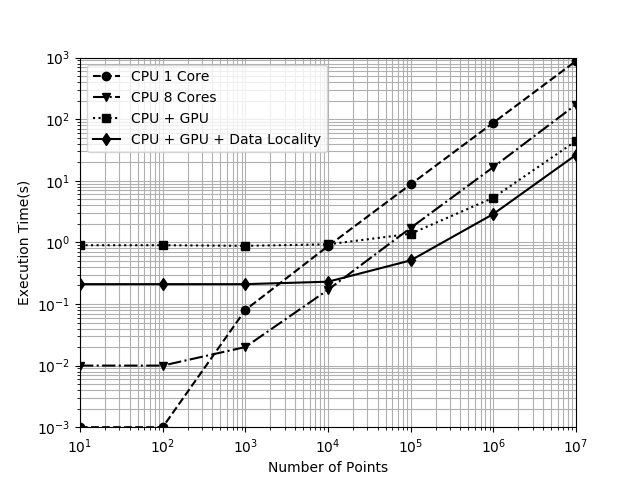

# Chapter 6: Best Programming Practicies

This chapter does a great job summarizing some basic (mildly obvious) programming best practices and then ends with a real-world example that walks the reader through the process (this is great). The author acknowledges that providing an example in a book such as this is hard to get beyond _toy_ scenarios, but he does his best to provide a representative sample. The chapter leads out with his objectives for readers to learn:

- The necessity of baseline profiling
- The strategy of incremental acceleration and verification
- Techniques to maximize on-device computation
- Techniques to minimize data transfer and improvde data locality

He then walks through this process and explains that most of these "best practices" are not unique to OpenACC and really apply to all heterogeneous computing optimizations. In his overview section he gives a brief description of what he means by maximizing on-device computation and optmizing data locality. He then digs much deeper into both of these topics in sections 6.2 and 6.3

Most of the material in this section is somewhat obvious but he points out a couple of things that seemed noteworthy to me:

1. The use of `atomic`: He suggests that there are many times wherein loops update a shared varible and might not be considered data parallel. In these cases, he recommends testing with `#pragma acc atomic` before the updates (much like you would do a lock) and test its affects - you may see perf improvements while still ensuring accuracy.
1. Wrapping various directives with the `if` clause and peforming runtime tuning. He describes a use case wherein you may be unsure of the appropriateness of sending code to the device given the current hardware usage. In these scenarios, you can run a quick (relatively) runtime test to determine the best place to run your code and then set a boolean flag that can guard any of the directives and control where the code is run. 
1. As before, this author mentions the `present` clause which can intelligently indicate that code should be run on the device only if the data is already present. 
1. He describes data clauses and unstructured data lifetimes which can be helpful in bounding when data is moved to/from the device.
1. Finally, there is a discussion of array shaping - the notion that you only move the portion of the array data needed to the device and back again (sub-selections).

## Example Optimizations

The chapter ends with an example wherein the author walks you through the entire process previously discussed. He utilizes a theromdynamic table lookup code and briefly explains what it does and how it works. He has you compile it and then walk through the following steps:

### Profiling

Just as described many places in the book, you have to be good at profiling and therefore he describes how you go about doing it with the example application.

I ran the `build_and_profile.sh` script and have included the pertinent results below:

```text
Flat profile:

Each sample counts as 0.01 seconds.
  %   cumulative   self              self     total
 time   seconds   seconds    calls  ns/call  ns/call  name
 60.89      6.01     6.01 200000000    30.05    30.05  bisection(float, float const*, int)
 35.97      9.56     3.55 100000000    35.50    95.60  LookupTable2D::interpolate(float, float)
  1.11      9.67     0.11                             main
  0.81      9.75     0.08                             _init
  0.71      9.82     0.07                             ___ZN13LookupTable2D11interpolateEffEND
  0.51      9.87     0.05                             ___Z9bisectionfPKfiEND
  0.00      9.87     0.00        1     0.00     0.00  LookupTable2D::LookupTable2D()
  0.00      9.87     0.00        1     0.00     0.00  LookupTable2D::~LookupTable2D()
  0.00      9.87     0.00        1     0.00     0.00  __sti___12_thermo_cpu_c_e48536f4  

 ...

Call graph (explanation follows)

index % time    self  children    called     name
                                                 <spontaneous>
[1]     98.0    0.11    9.56                 main [1]
                3.55    6.01 100000000/100000000     LookupTable2D::interpolate(float, float) [2]
                0.00    0.00       1/1           LookupTable2D::LookupTable2D() [11]
                0.00    0.00       1/1           LookupTable2D::~LookupTable2D() [12]
-----------------------------------------------
                3.55    6.01 100000000/100000000     main [1]
[2]     96.9    3.55    6.01 100000000         LookupTable2D::interpolate(float, float) [2]
                6.01    0.00 200000000/200000000     bisection(float, float const*, int) [3]
-----------------------------------------------
                6.01    0.00 200000000/200000000     LookupTable2D::interpolate(float, float) [2]
[3]     60.9    6.01    0.00 200000000         bisection(float, float const*, int) [3]
-----------------------------------------------
                                                 <spontaneous>
[4]      0.8    0.08    0.00                 _init [4]
-----------------------------------------------
                                                 <spontaneous>
[5]      0.7    0.07    0.00                 ___ZN13LookupTable2D11interpolateEffEND [5]
-----------------------------------------------
                                                 <spontaneous>
[6]      0.5    0.05    0.00                 ___Z9bisectionfPKfiEND [6]
-----------------------------------------------
                0.00    0.00       1/1           main [1]
[11]     0.0    0.00    0.00       1         LookupTable2D::LookupTable2D() [11]
-----------------------------------------------
                0.00    0.00       1/1           main [1]
[12]     0.0    0.00    0.00       1         LookupTable2D::~LookupTable2D() [12]
-----------------------------------------------
                0.00    0.00       1/1           __libc_csu_init [43]
[13]     0.0    0.00    0.00       1         __sti___12_thermo_cpu_c_e48536f4 [13]
-----------------------------------------------

```

As the author points out, the main hotspot is in the `bisection()` method.

### Acceleration with OpenACC

The next step in the process is to add acceleration directives. He shows adding data movement directives as well as loop parallelization commands. He then re-runs the tool having compiled it both for CPU, Multi-Core CPU, and CPU+GPU.

> NOTE: I started with the code samples on the author's github site and found that his inclusion of `<cmath>` to be problem causing. I changed this to `<math.h>` and was able to compile and run successfully.

```bash
# compile CPU version
$ pgc++ --c++11 thermo_openacc.c -o out_cpu

# compile GPU version
$ pgc++ --c++11 -acc thermo_openacc.c -o out_gpu

# run CPU version
$ time ./out_cpu 100000 1000

real    0m8.771s
user    0m8.759s
sys     0m0.012s

# run GPU version
$ time ./out_gpu 100000 1000

real    0m1.485s
user    0m1.128s
sys     0m0.319s
```

This looks pretty good, however (as the author points out), this isn't a fair comparison as we only used one of the CPU cores. Let's recompile for multi-core support and re-run

```bash
# complile Multicore version
$ pgc++ --c++11 -acc -ta=multicore thermo_openacc.c -o out_cpu_multicore

# set number of cores available
$ export ACC_NUM_CORES=8

# run multicore version
$ time ./out_cpu_multicore 100000 1000

real    0m1.679s
user    0m13.293s
sys     0m0.000s
```

At this point, the CPU+GPU code is significantly faster than the single-core CPU code, but only slightly faster than the multi-core CPU code.

### Optimized Data Locality

Once the logic has been parallelized, the focuses on where data lives, where it needs to be, and how we can optimize the code accordingly. He adds a few data directives as well as a data enter/exit region. The code is recompiled and, at this point, the CPU+GPU code clearly outshines either of the other options.

There is a script provided (`build_and_test.sh`) that runs through a number of data sizes for each of the profile options. I ran these and provide my results in the plot below:



### Data-Dependent Optimizations

Finally, he walks through testing the code with different data sizes and shows that there are clear benefits to running on the device once the data set grows beyond a certain size, but performance is degraded below that point. He uses this as a discussion point for using an `if` clause to only parallelize when the input data is beyond a certain scale.


[<< Previous](../Chapter_05/readme.md)
|
[Next >>](../Chapter_07/readme.md)
