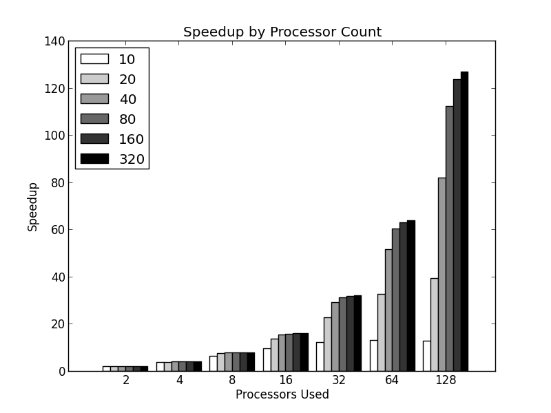
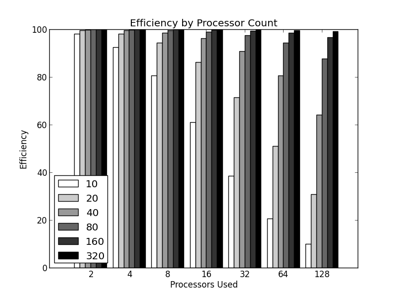

## Problem 1

The equations needed to solve this are as follows:

Calculate the number of tasks to run on a given processor:
$${tasks}_p = \frac{{tasks}_{total}}{p} = \frac{10^{12}}{10^3} = 10^9$$

Given the number of tasks performed by a processor per second = $10^6$, we know that the time needed just for computation by a single core (and therefore all cores due to perfect synchronicity) is $\frac{10^9}{10^6}$ or $10^3$ seconds.

Further, given the number of messages sent per processor is $10^9(10^3-1)$ or $9.99 * 10^11$

We now can calculate the total time as 

$${time}_{total} = t_p + (m_p * t_m)$$

Where $t_p$ is the compute time per processor, $m_p$ is the number of messages sent per processor, and $t_m$ is the time needed to send each message.

### 1.1
$${time}_{total} = 10^3 + (9.99 * 10^11) * 10^{-9}$$
$${time}_{total} = 1,999 $$ 
or
$$1.999 * 10^3 {seconds}$$ 

### 1.2
$${time}_{total} = 10^3 + (9.99 * 10^11) * 10^{-3}$$
$${time}_{total} = 999,001,000$$
or
$$9.99001 * 10^8{seconds}$$ 

\pagebreak

## Problem 2
If you assume that the two locks were implemented in the read-write lock fashion as described in section 4.9.3, yes as they have in-build mechanisms to intelligently handle the "read & make a descion" + "write based on the results of the read" scenario. 

If, instead, you were to hand-roll as two separate locks, you could still get into trouble as you could have a race condition wherein `T0` read-locks the list, reads the list, makes a decision regarding a delete operation, and then releases a lock. Then, before `T0` is able to obtain a write lock, maybe `T1` gets a lock, modifies a the list in such a way as to make `T0`'s planned execution invalid. When `T0` does obtain the write lock, it may then fail.

\pagebreak

## Problem 3

Assuming the number of processors $p$ is even, the bisection width of a square planar mesh is $\sqrt{p}$.

Derived by observation after drawing out square planar mesh's of $p=2$, $p=4$, $p=6$ 

\pagebreak

## Problem 4

Assuming the number of processors $p$ is even, the bisection width of a square planar mesh is $2\sqrt{p}$.

Derived by observation after drawing out 3-D square planar mesh's of $p=2$ and $p=4$ 

\pagebreak

## Problem 5

### 5.a
|P  |$S_{10}$|$E_{10}$|$S_{20}$|$E_{20}$|$S_{40}$|$E_{40}$|$S_{80}$|$E_{80}$|$S_{160}$|$E_{160}$|$S_{320}$|$E_{320}$|
|--:|-------:|-------:|-------:|-------:|-------:|-------:|-------:|-------:|--------:|--------:|--------:|--------:|
|1	|1	     |100.00% |1	   |100.00% |1 	     |100.00% |1	   |100.00% |1	      |100.00%  |1	      |100.00%  |
|2	|1.96    |98.04%  |1.99    |99.50%  |1.99	 |99.88%  |1.99	   |99.97%  |1.99	  |99.99%   |1.99	  |100.00%  |
|4	|3.70	 |92.59%  |3.92	   |98.04%  |3.98    |99.50%  |3.99    |99.88%  |3.99     |99.97%   |3.99     |99.99%   |
|8  |6.45    |80.65%  |7.55    |94.34%  |7.88    |98.52%  |7.97    |99.63%  |7.99     |99.91%   |7.99     |99.98%   |
|16 |9.76	 |60.98%  |13.79   |86.21%  |15.38   |96.15%  |15.84   |99.01%  |15.96    |99.75%   |15.99    |99.94%   |
|32	|12.31	 |38.46%  |22.86   |71.43%  |29.09   |90.91%  |31.22   |97.56%  |31.80    |99.38%   |31.95    |99.84%   |
|64	|13.22	 |20.66%  |32.65   |51.02%  |51.61   |80.65%  |60.38   |94.34%  |63.05    |98.52%   |63.76    |99.63%   |
|128|12.85	 |10.04%  |39.51   |30.86%  |82.05   |64.10%  |112.28  |87.72%  |123.67   |96.62%   |126.89   |99.13%   |

### 5.b
With `N` held constant, speedups increase and efficiencies decrease as `P` increases. 

### 5.c
With `P` held constant speedups approach optimal (approaches `P`) and efficiencies approach 100%.

\pagebreak

## Problem 6

### 6.1
Yes (possibly).

### 6.2
In general, the processors will not share any aspect of the output vector `y` and, it is possible that they will never experience false sharing. However, it is possible that at the boundaries, the 8-numbers stored in memory as a cache line will overlap between the two. Even so, it is highly unlikely due to the fact that one thread would be working on the proximal boundary while the other is at the other end reducing the chances of a false sharing condition.

__NOTE:__ _Due to the fact that the threads in question (`0` and `2`) are non-consecutive, it is most likely that they will not be processing "neighbors" of y and therefore will not be in danger of false sharing._

__NOTE:__ The question didn't reference core-specific or thread-specific caches. If there is only a single core on a processor, than all threads share the same cache's (L1-L3) and therefore cache coherency doesn't occur across caches... and neither does false sharing.

### 6.3
Yes, but with the same low-probablity as described in 6.2. The fact that threads 0 and 3 are on different processors does not affect the false sharing (or lack thereof) in this scenario.

\pagebreak

## Problem 7

### 7.1
Given that Vector Processors differ from traditional CPUs in that they are designed to operate on an entire vector of data at a time (rather than each element), the vector processor would require only a single load, add, and store operation for the vector-length items.

My supposition is that, due to the fact that the two inner lines in the loop are independent from each other, the vector processor would optimize this into two separate "main" operations. The first would process the all of the values for y[i] based on a and x[i] and would represent a single load, add and store. The second would handle the summing based on the $z[i]^2$ operations.

### 7.2
A GPU would not do anything specifically magical on this (all depends on how the kernel was written), but given the structure and the GPU's leaning towards SIMD, it would likely make the most sense to, as above, split the operations in a similar fashion as described in `7.1`. The item to consider, however, is the impact of the aggregation operation (summing) within the loop.

\pagebreak

## Problem 8

### 8.1
Minimum  number of cache lines to store `y`: 1

### 8.2
Maximum number of cache lines to store `y`: 2

### 8.3
Maximum different ways `y` could be stored in cache? 8, but never more than two lines (due to C's guarantee that vectors are stored contiguously in memory).

### 8.4
6 - the number of different ways pairs of threads can be assigned to two cores on the dual-core, dual-processor system

$$ x = \frac{n!}{r!(n-r!)}$$

### 8.5
Yes. If we assume threads $T_0$ and $T_1$ get assigned to processor $P_0$ and $T_2$ adn $T_3$ are assigned to $P_1$ and we further assume that `y` is stored in memory such that the first half (the portion owned by $T_0$ and $T_1$) of it is the second half of a cache line and the second half `y` is the first half of a different cache line.

### 8.6
48 - the number of variants of the assignments of components to cache lines and threads to processors

### 8.7
Possibly 6 but most likely 2, depending. There is only 1 cache configuration that can result in no false sharing (split in the middle). If you assume true randomness of assignments of threads to portions of the problem (consecutive thread numbers mean nothing), then you have a possibility of 6. If, however, thread id directly relates to the portion of the problem being addressed, there are only two scenarios wherein you can ensure no false sharing:

- P0 = {T0, T1}, P1 = {T2, T3}, Cache is split in the middle
- P0 = {T2, T3}, P1 = {T0, T1}, Cache is split in the middle

