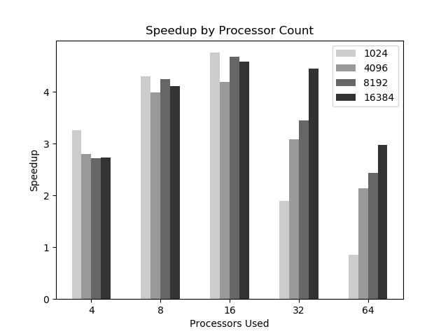
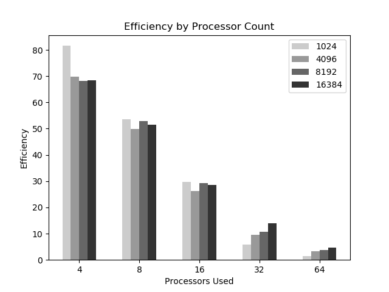

# CSC5760 Programming Assignment 2

> TODO: check hyperthreads
> TODO: calculate efficiencies
> TODO: calculate speedup

## Pre-Requisites
Building this program requires the following to be installed on the platform:

- cmake version 3.6 or greater


## Building the Code
Compiling the applictions in this assignment requires the use of cmake. From the current directory, create a build directory, move into it, and then call cmake using the `CMakeLists.txt` file in the parent directory. Then, run `make` and the executeable will be built into the directory. Instructions/commands are as follows:

```bash
$ mkdir build
$ cd build
$ cmake ..
$ make
```

This will result in two executeables being built: `MatVec` and `MatVecMPI`.

## Running the Code
In general, running each of the executeables pasing the `--help` argument should cause them to display their usage information, after which, running the application is as simple as providing the appropriate values. While not required, `MatVecMPI` is designed to be run using `mpiexec`.

\pagebreak


## Single-Threaded (sequential) Solution
The baseline for this project is provided via the `MatVec` program which is a sequential implementation of the application. While there are a handful of parameters that can be provided, the test data below was generated only providing the size parameter. This parameter defines the size of each side of the source matrix as well as the size of the source vector.

Example calls for each test:
```bash
$ ./MatVec --size 1024
$ ./MatVec --size 4096
$ ./MatVec --size 8192
$ ./MatVec --size 16384
````

|  | n=1024 | n=4096 | n=8192 | n=16384 |
|--|-------:|-------:|-------:|--------:|
|Answer|21,460,970|343,842,766|1,375,567,846|5,502,369,770|
|Run 1|7.921934E-03|	7.179379E-02|	2.575581E-01|	9.346480E-01|
|Run 2|7.885933E-03|	7.105184E-02|	2.529349E-01|	9.430301E-01|
|Run 3|7.858038E-03|	7.199097E-02|	2.571590E-01|	9.423368E-01|
|Run 4|7.834911E-03|	7.107496E-02|	2.584920E-01|	9.331219E-01|
|Run 5|7.314920E-03|	7.118607E-02|	2.586060E-01|	9.431419E-01|
|Run 6|7.844925E-03|	7.133818E-02|	2.602808E-01|	9.375632E-01|
|Run 7|7.374048E-03|	7.113910E-02|	2.588539E-01|	9.432602E-01|
|Run 8|7.910013E-03|	7.130098E-02|	2.663560E-01|	9.350610E-01|
|Run 9|7.886887E-03|	7.108593E-02|	2.565939E-01|	9.335470E-01|
|Run 10|7.900000E-03|	7.108808E-02|	2.725461E-01|	9.340279E-01|
|**Average**|**7.773161E-03**|**7.130499E-02**|**2.599381E-01**|**9.379738E-01**|


### Methodology
As can be observed from the table above, each setting was run 10 times in order to flatten the effects of transient activities of the test platform on the resulting data. Results should be viewed for their trends/relative values rather than absolute measurements.

### Example output from one of the runs:
```bash
[2017-11-26 14:04:31.243275] [0x00007fb897a67740] [info]    Matrix-Vector Multiplication (Serial)
[2017-11-26 14:04:31.243320] [0x00007fb897a67740] [info]    Cores available:  8
[2017-11-26 14:04:31.243426] [0x00007fb897a67740] [info]    Using Seed Value: 0
[2017-11-26 14:04:31.243447] [0x00007fb897a67740] [info]    Using Mod Value: 10
[2017-11-26 14:04:31.243459] [0x00007fb897a67740] [info]    Using Size Value: 16384
[2017-11-26 14:04:31.243478] [0x00007fb897a67740] [info]    Creating Matrix...
[2017-11-26 14:04:32.155438] [0x00007fb897a67740] [info]    Creating Vector...
[2017-11-26 14:04:32.155512] [0x00007fb897a67740] [info]    Performing Muliplication...
[2017-11-26 14:04:32.859932] [0x00007fb897a67740] [info]    Summing Results...
[2017-11-26 14:04:32.859995] [0x00007fb897a67740] [info]    Displaying Results:
[2017-11-26 14:04:32.860001] [0x00007fb897a67740] [info]    Summed Result: 5502369770
[2017-11-26 14:04:32.860004] [0x00007fb897a67740] [info]    Time Elapsed...
Elapsed time = 7.044780e-01 seconds
```

\pagebreak


## Multi-Threaded (MPI/Parallel) Solution
The comparision version of this project is provided via the `MatVecMPI` program which is a MPI implementation of the `MatVec` application. The parameters for both applications are the same, however the `MatVecMPI` application is intended to be run via `mpiexec` (see the examples below).

### Methodology
Consistent with the serial/baseline version of the tests, each setting was run 10 times in order to flatten the effects of transient activities of the test platform on the resulting data. Results should be viewed for their trends/relative values rather than absolute measurements.

### Platform
These tests were performed/data was collected on a workstation class machine with 12 physical cores and hyper-threading enabled. As such, it should be expected that performance (relative to the sequential version) should improve for 4 and 8 (and possibly 16 due to hyperthreading) but will flatten or degrade for node counts beyond that.


### Utilizing 4 processors:
```bash
$ mpiexec -n 4 MatVecMPI --size 1024
$ mpiexec -n 4 MatVecMPI --size 4096
$ mpiexec -n 4 MatVecMPI --size 8192
$ mpiexec -n 4 MatVecMPI --size 16384
```

|  | n=1024 | n=4096 | n=8192 | n=16384 |
|--|-------:|-------:|-------:|--------:|
|Answer|21,460,970|343,842,766|1,375,567,846|5,502,369,770|
|Run 1|2.27E-03|	2.57E-02|	1.00E-01|	3.48E-01|
|Run 2|2.05E-03|	2.56E-02|	9.27E-02|	3.40E-01|
|Run 3|2.26E-03|	2.49E-02|	9.86E-02|	3.40E-01|
|Run 4|2.55E-03|	2.56E-02|	9.39E-02|	3.55E-01|
|Run 5|2.31E-03|	2.57E-02|	8.75E-02|	3.41E-01|
|Run 6|2.45E-03|	2.55E-02|	9.46E-02|	3.42E-01|
|Run 7|2.58E-03|	2.57E-02|	9.88E-02|	3.41E-01|
|Run 8|2.44E-03|	2.57E-02|	9.52E-02|	3.41E-01|
|Run 9|2.53E-03|	2.52E-02|	9.75E-02|	3.40E-01|
|Run 10|2.37E-03|	2.57E-02|	9.54E-02|	3.41E-01|
|**Average**|**2.381992E-03**|**2.551570E-02**|**9.545253E-02**|**3.429312E-01**|
|**Speed Up**|**3.263**|**2.795**|**2.723**|**2.735**|		
|**Efficiency**|**81.58%**|**69.86%**|**68.08%**|**68.38%**|


### Utilizing 8 processors:

```bash
$ mpiexec -n 8 MatVecMPI --size 1024
$ mpiexec -n 8 MatVecMPI --size 4096
$ mpiexec -n 8 MatVecMPI --size 8192
$ mpiexec -n 8 MatVecMPI --size 16384
```

|  | n=1024 | n=4096 | n=8192 | n=16384 |
|--|-------:|-------:|-------:|--------:|
|Answer|21,460,970|343,842,766|1,375,567,846|5,502,369,770|
|Run 1|1.77E-03|	1.80E-02|	5.97E-02|	2.29E-01|
|Run 2|1.50E-03|	1.75E-02|	5.93E-02|	2.28E-01|
|Run 3|1.68E-03|	1.82E-02|	5.96E-02|	2.28E-01|
|Run 4|1.73E-03|	1.83E-02|	5.97E-02|	2.28E-01|
|Run 5|1.97E-03|	1.81E-02|	6.53E-02|	2.28E-01|
|Run 6|1.59E-03|	1.76E-02|	6.54E-02|	2.27E-01|
|Run 7|1.72E-03|	1.75E-02|	6.54E-02|	2.28E-01|
|Run 8|1.97E-03|	1.82E-02|	5.98E-02|	2.27E-01|
|Run 9|1.86E-03|	1.76E-02|	5.90E-02|	2.29E-01|
|Run 10|2.32E-03|	1.77E-02|	6.01E-02|	2.29E-01|
|**Average**|**1.811457E-03**|**1.786940E-02**|**6.132865E-02**|**2.280466E-01**|
|**Speed Up**|**4.291**|**3.990**|**4.238**|**4.113**|		
|**Efficiency**|**53.64%**|**49.88%**|**52.98%**|**51.41%**|


### Utilizing 16 processors:
```bash
$ mpiexec -n 16 MatVecMPI --size 1024
$ mpiexec -n 16 MatVecMPI --size 4096
$ mpiexec -n 16 MatVecMPI --size 8192
$ mpiexec -n 16 MatVecMPI --size 16384
```

|  | n=1024 | n=4096 | n=8192 | n=16384 |
|--|-------:|-------:|-------:|--------:|
|Answer|21,460,970|343,842,766|1,375,567,846|5,502,369,770|
|Run 1|1.75E-03|	1.82E-02|	4.97E-02|	1.99E-01|
|Run 2|1.49E-03|	1.74E-02|	6.11E-02|	2.09E-01|
|Run 3|1.55E-03|	1.69E-02|	5.35E-02|	2.08E-01|
|Run 4|1.49E-03|	1.84E-02|	5.42E-02|	1.97E-01|
|Run 5|1.68E-03|	1.51E-02|	5.64E-02|	2.20E-01|
|Run 6|1.58E-03|	1.58E-02|	4.96E-02|	1.93E-01|
|Run 7|1.72E-03|	1.72E-02|	5.12E-02|	2.00E-01|
|Run 8|1.63E-03|	1.50E-02|	5.79E-02|	2.27E-01|
|Run 9|1.82E-03|	1.85E-02|	5.89E-02|	2.04E-01|
|Run 10|1.63E-03|	1.77E-02|	6.42E-02|	1.94E-01|
|**Average**|**1.635098E-03**|**1.701532E-02**|**5.567370E-02**|**2.050218E-01**|
|**Speed Up**|**4.754**|**4.191**|**4.669**|**4.575**|
|**Efficiency**|**29.71%**|**26.19%**|**29.18%**|**28.59%**|


### Utilizing 32 processors:
```bash
$ mpiexec -n 32 MatVecMPI --size 1024
$ mpiexec -n 32 MatVecMPI --size 4096
$ mpiexec -n 32 MatVecMPI --size 8192
$ mpiexec -n 32 MatVecMPI --size 16384
```

|  | n=1024 | n=4096 | n=8192 | n=16384 |
|--|-------:|-------:|-------:|--------:|
|Answer|21,460,970|343,842,766|1,375,567,846|5,502,369,770|
|Run 1|2.10E-03|	2.37E-02|	6.91E-02|	1.97E-01|
|Run 2|2.68E-03|	2.24E-02|	9.95E-02|	2.13E-01|
|Run 3|2.19E-03|	1.92E-02|	7.21E-02|	2.07E-01|
|Run 4|2.97E-03|	2.67E-02|	7.88E-02|	2.19E-01|
|Run 5|2.54E-03|	2.27E-02|	8.16E-02|	2.12E-01|
|Run 6|2.60E-03|	2.40E-02|	7.11E-02|	2.12E-01|
|Run 7|1.21E-02|	2.46E-02|	8.48E-02|	1.76E-01|
|Run 8|3.10E-03|	2.33E-02|	6.38E-02|	2.61E-01|
|Run 9|8.55E-03|	2.17E-02|	5.95E-02|	2.06E-01|
|Run 10|2.16E-03|	2.34E-02|	7.43E-02|	2.07E-01|
|**Average**|**4.096699E-03**|**2.317393E-02**|**7.547982E-02**|**2.109428E-01**
|**Speed Up**|**1.897**|**3.077**|**3.444**|**4.447**|
|**Efficiency**|**5.93%**|**9.62%**|**10.76%**|**13.90%**|


### Utilizing 64 processors:

```bash
$ mpiexec -n 64 MatVecMPI --size 1024
$ mpiexec -n 64 MatVecMPI --size 4096
$ mpiexec -n 64 MatVecMPI --size 8192
$ mpiexec -n 64 MatVecMPI --size 16384
```

|  | n=1024 | n=4096 | n=8192 | n=16384 |
|--|-------:|-------:|-------:|--------:|
|Answer|21,460,970|343,842,766|1,375,567,846|5,502,369,770|
|Run 1|5.56E-03|	2.65E-02|	8.63E-02|	3.13E-01|
|Run 2|2.11E-02|	2.64E-02|	8.39E-02|	3.73E-01|
|Run 3|4.15E-03|	5.54E-02|	1.06E-01|	3.19E-01|
|Run 4|9.02E-03|	2.51E-02|	1.14E-01|	3.00E-01|
|Run 5|4.88E-03|	2.51E-02|	1.12E-01|	3.10E-01|
|Run 6|7.82E-03|	2.90E-02|	9.43E-02|	3.38E-01|
|Run 7|4.85E-03|	4.76E-02|	1.16E-01|	3.16E-01|
|Run 8|2.21E-02|	2.97E-02|	1.02E-01|	2.59E-01|
|Run 9|4.70E-03|	3.86E-02|	1.49E-01|	3.02E-01|
|Run 10|7.14E-03|	3.07E-02|	1.05E-01|	3.25E-01|
|**Average**|**9.127783E-03**|**3.341189E-02**|**1.067291E-01**|**3.153188E-01**|
|**Speed Up**|**0.852**|**2.134**|**2.435**|**2.975**|
|**Efficiency**|**1.33%**|**3.33%**|**3.81%**|**4.65%**|


\pagebreak

## Discussion
As can be seen from the plots below, overall runtime performance increased for process counts of 4, 8, and 16 and then tailed off, most likely due to shear overhad due to creating/managing many more processes than available threads on the machine. The efficiency plot communicates a clear story... as the process count increases the efficiency drops drastically.



