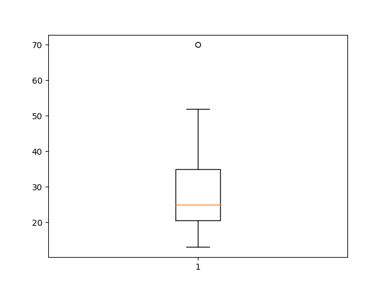

## Problem 1.7 (15pts)

Outliers are often discarded as noise. However, one person's garbage could be another's treasure. For example, exceptions in credit card transactions can help us detect the fraudulent use of credit cards. Using fraudulence detection as an example, propose two methods that can be used to detect outliers and discuss which one is more reliable.


\pagebreak

## Problem 1.9 (10pts)

What are the major challenges of mining a huge amount of data (e.g., billions of tuples) in comparison with mining a small amount of data (e.g. data set of a few hundred tuples)?


\pagebreak

## Problem 2.2 (not g) (30pts)

__Suppose that the data for analysis includes the attribute age. The age values for the data tuples are (in increasing order) `13, 15, 16, 16, 19, 20, 20, 21, 22, 22, 25, 25, 25, 25, 30, 33, 33, 35, 35, 35, 35, 36, 40, 45, 46, 52, 70`.__

a. __What is the mean of the data? What is the median?__

Mean is the average, or central value. 

$$ \bar{x} = \frac{1}{n}\left(\sum\limits_{i=1}^n x_i\right)$$

```python
ages = [13, 15, 16, 16, 19, 20, 20, 21, 22, 22, 25, 25, 25, 25, 30, 33, 33, 35, 35, 35, 35, 36, 40, 45, 46, 52, 70]
mean = sum(ages)/float(len(ages))
mean
29.96
```

Median is the middle number. 

```python
ages.sort()
median = ages[len(ages)/2]  # works well due to length being odd
median
25
```

b. __What is the mode of the data? Comment on the data's modality (i.e., bimodal, trimodal, etc.).__

Mode is the most frequent value in the data. 

```python
distinct_ages = set(ages)
for distinct_age in distinct_ages:
    print "{0} - {1}".format(distinct_age, ages.count(distinct_age))

33 - 2
45 - 1
35 - 4
36 - 1
70 - 1
40 - 1
13 - 1
46 - 1
15 - 1
16 - 2
19 - 1
20 - 2
21 - 1
22 - 2
25 - 4
30 - 1
52 - 1

```
It is seen that the data is bi-modal with values `25` and `35` occuring 4 times each.


c. __What is the midrange of the data?__

Midrange is the average of the largest and smallest values in the set

```python
midrange = (min(ages) + max(ages))/2
midrange
41
```


d. __Can you find (roughly) the first quartile ($Q_1$) and the third quartile ($Q_3$) of the data?__

```python
q_1 = ages[len(ages)/4]
q_3 = ages[(len(ages)/4)*3]

q1
20

q3
35
```


e. __Give the five-number summary of the data__

The _five number summary_ of the data is the minimum, $Q_1$, median, $Q_3$, and maximum. For this data set, the five-number summary is:

```
13, 20, 25, 35, 70
```

f. __Show a boxplot of the data__

```python
import matplotlib.pyplot as plt

plt.boxplot(ages)
plt.show()

```



\pagebreak

## Problem 2.6 (not d) (15pts)

Given two objects represented by the tuples (22, 1, 42, 10) and (20, 0, 36, 8):

a. Compute the Euclidean distance between the two objects

b. Compute the Manhattan distance between the two objects

c. Compute the Minkowski distance between the two objects, using q=3.

\pagebreak


## Problem 3.2 (10pts)

In real-world data, tuples with missing values for some attributes are a common occurrence. Discribe various methods for handling this problem.

\pagebreak

## Problem 3.7 (20pts)

Using the data for age given in Exercise 3.3 (13, 15, 16, 16, 19, 20, 20, 21, 22, 22, 25, 25, 25, 25, 30, 33, 33, 35, 35, 35, 35, 36, 40, 45, 46, 52, 70), answer the following:

a. Use min-max normalization to transform the value 35 for age onto the range [0.0, 1.0].

b. Use z-score normalization to transform the value 35 for age, where teh standard deviation of age is 12.94 years.

c. Use normalization by decimal scaling to transform the value 35 for age.

d. Comment on which method you would prefer to use for the given data, giving reasons as to why.

