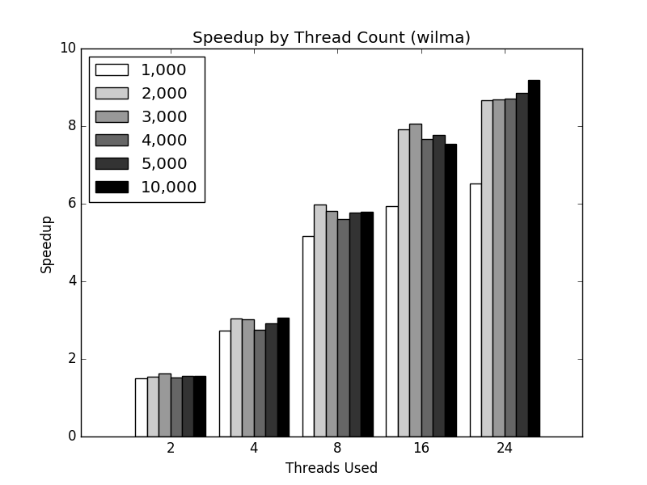
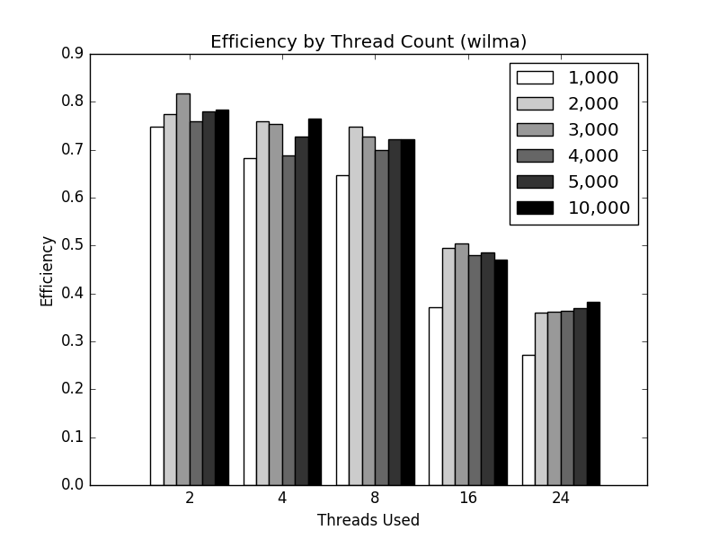
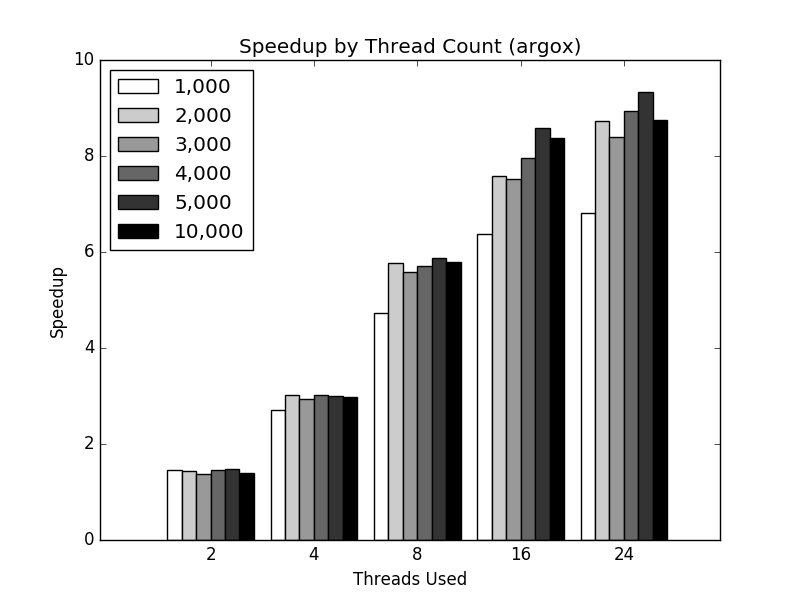
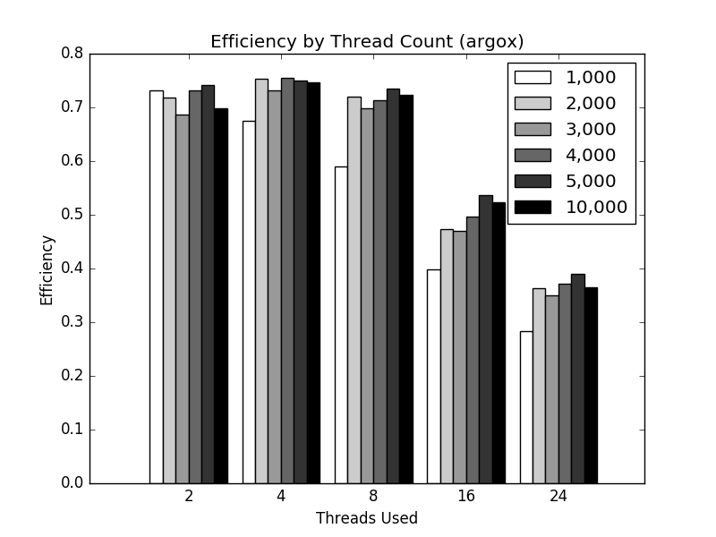

# CSC 6740 Homework 1
### Rob Gillen

## Overview
The purpose of this assignment was to implement matrix multiplication using OpenMP and then compare the effects of parallelization on overall runtime. We were told to assume square matricies and to test with matrix side-sizes of 1000, 5000, and 10000. We were to test on thread counts of 1, 2, 4, 8, 16 and then present a report on the speedup and efficiency of our approach.

## Approach
I elected to utilize a data-parallization approach. In OpenMP, the processes access a shared heap while each thread has its own instruction pointer and stack. I generated both the source and result matricies on the heap allowing each thread to interact with them as needed (careful not to step on each other). Matrix multiplication can easily be thought of as a set of three loops nested within each other. I split the task size of the outermost loop by the number of threads being used which ensured the calculations and answers would not introduce race conditions.

## Test Platform
I utilized two different platforms for testing, primarily due to personal curiosity. The first, `argox` is a destop workstation with 24 cores and 32 GB of RAM. The second, `wilma` is a slightly dated (~5 years) HP server that also has 24 cores but has 192 GB of RAM. `Wilma` also has faster hard drives and server-class processors. Due to the configurations available, I expanded the tests scenarios to include 24 threads as well as testing matrix-side sizes of 2000, 3000 and 4000.

## Results
The results, as illustrated in the following plots, show clear benefits from the parallelization of the input problem. A simple example, multiplying two 10,000 x 10,000 matricies took over 132 minutes using the single-threaded approach yet only needed just over 14 minutes when utilizing all 24 threads available on the machine. It should be noted that while performance increased with more threads, it did not do so linearly, and the total efficiency of the system degraded significantly. This is a topic for further investigation.

## Conclusions
The results are essentially as expected - as one parallelizes the source problem, the overall runtime decreases. I was pleased with the relative ease of using the OpenMP platform (at least, given the simple problem set) and will consider using it on future problems. I am interested to understand the reasons behind the fall-off in efficiency as scale increased.
